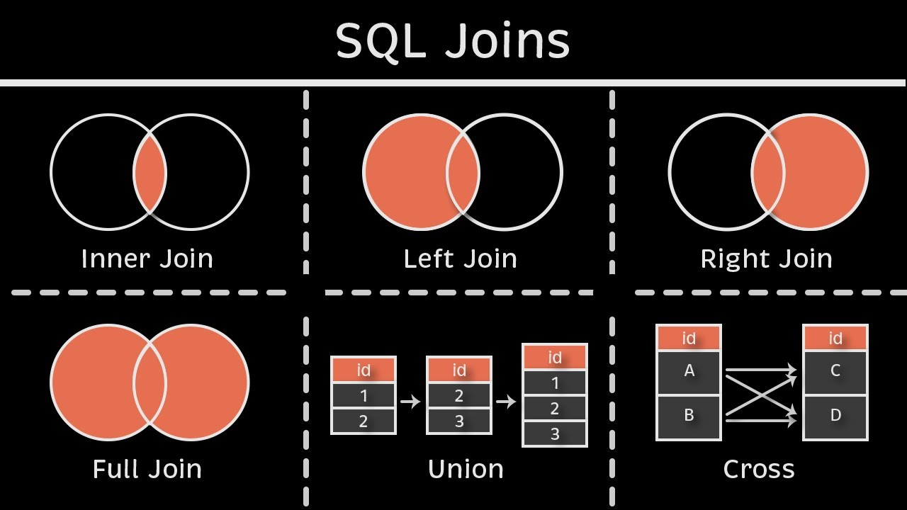
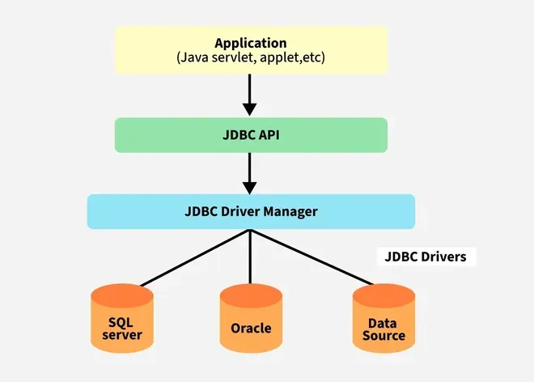

# 1. SQL

## 1.1 SQL Syntax

**Insert Record**

```sql
INSERT INTO <table-name>[(<col-1>, <col-2>, <col-3>)] VALUES(<value-1>, <value-2>, <value-3>);
```

**Update Record**

```sql
UPDATE <table-name>
SET <col-1> = <new-value> [, ..., <col-n> = <new-value>]
[WHERE <condition>]
```

**Delete Record**

```sql
DELETE FROM <table-name>
[WHERE <condition>]
```

**Select Records**

```sql
SELECT <col-1> [<col-2>, <col-3>, ...]
FROM <table-name>
[WHERE <condition>]
[GROUP BY <col>]
[HAVING <condition>]
[ORDER BY <col> [ASC/DESC]]
[OFFSET M] [LIMIT N]
```

**Join**



## 1.2 Stored Procedure

**Store Procedure**

```sql
CREATE PROCEDURE [procedure_name] ([IN/OUT param1, IN/OUT param2, ...])
BEGIN
    [sql_statement]
END
```

**Call Procedure**

```
CALL procedure_name ([param1, param2]);
```

**Example:**

```sql
CREATE PROCEDURE countCategory(OUT c INT)
BEGIN
    SELECT COUNT(*) INTO C
    FROM category;
END
```

```sql
CALL countCategory(@c);
SELECT @c;
```

# 2. JDBC

## 2.1 Definition

JDBC is an API that helps applications to communicate with databases. It allows Java programs to connect to a database, run queries, retrieve and manipulate data. Because of JDBC, Java applications can easily work with different relational databases like MySQL, Oracle, PostgreSQL and more.



1. **Application:** It can be a Java application or servlet that communicates with a data source.
2. **JDBC API:** It allows Java programs to execute SQL queries and get results from the database. Some key components of JDBC API include:
    - Interfaces like `Driver`, `ResultSet`, `RowSet`, `PreparedStatement` and `Connection` that helps managing different database tasks.
    - Classes like `DriverManager`, `Types`, `Blob` and `Clob` that helps managing database connections.
3. **DriverManager:** It plays an important role in the JDBC architecture. It uses some database-specific drivers to effectively connect enterprise applications to databases.
4. **JDBC drivers:** These drivers handle interactions between the application and the database.


| Class/Interfaces | Description |
| -------------- | --------------- |
| `DriverManager` | Manages JDBC drivers and establishes database connections. |
| `Connection` | Represents a session with a specific database. |
| `Statement` | Used to execute SQL queries. |
| `PreparedStatement` | Precompiled SQL statement, used for dynamic queries with parameters. |
| `CallableStatement` | Used to execute stored procedures in the database. |
| `ResultSet` | Represents the result set of the query, allowing navigation through the rows. |
| `SQLException` | Handles SQL-related exceptions during database operations. |


## 2.2 Usage

**Step 1: Registering the Driver**

```java
Class.forName("com.mysql.cj.jdbc.Driver");
```

**Step 2: Creating the Connection**

```java
Connection connection = DriverManager.getConnection("jdbc:mysql://hostname:port/databaseName", "username", "password");
```
>Remember to close the connection with `close()` method.

**Step 3: Executing SQL Statments**

```java
Statement stm = connection.createStatement("SELECT * FROM category");
```

```java
String q = "INSERT INTO category(name, price, category_id) VALUES(?, ?, ?)";
PreparedStatement stm = connection.prepareStatement(q);
stm.setString(1, "iPhone");
stm.setDouble(2, 1000);
stm.setInt(3, 1);
stm.executeUpdate();
```

To execute [Stored Procedure](./JDBC.md#12-stored-procedure) in previous example:

```java
CallableStatement stm = connection.prepareCall("{ CALL countCategory(?) }");
stm.registerOutParameter(1, Types.INTEGER);
stm.execute();

stm.getInt(1);
```

**Step 4: Parsing Query Results**
