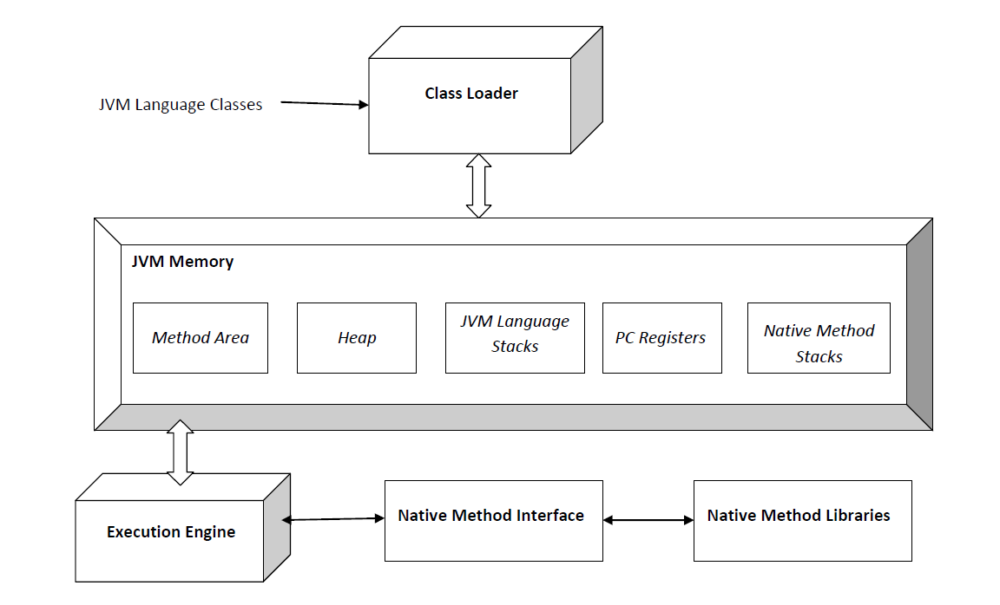

# 1. Overview


**Method Area:**
- Store code, constants and other class data (class name, parent's class name, methods, fields).
- Each JVM has 1 Method Area using for all threads.

**PC Register (Program Counter):**
- Each JVM thread has its own pc (program counter) register.
- At any point, each JVM thread is executing the code of a single method, namely the current method for that thread.
- For non-native methods, it stores the address of the current JVM instruction.
- For native methods, the PC value is undefined.
- On some platforms, the PC can also store a return address or native pointer.

**Native Method Stacks:**
- Native method stack is also known as C stacks.
- Native method stacks are not written in Java language.
- Handle the execution of native methods that interact with the Java code.
- This memory is allocated for each thread when it is created and can have either a fixed or dynamic size. Each thread has its own Native Method Stacks

**Stacks:**
- A stack is created when a thread is created and the JVM stack is used to store method execution data, including local variables, method arguments and return addresses.
- Each Thread has its own stack, ensuring thread safety.
- Stacks size can be either fixed or dynamic and it can be set when the stack is created.
- The memory for stack needs not to be contiguous.
- Once a method completes execution, its associated stack frame is removed automatically.

**Heap:**
- Heap is a shared runtime data area where objects and arrays are stored. It is created when the JVM starts.
- JVM allows user to adjust the heap size. When the new keyword is used the object is allocated in the heap and its reference is stored in the stack.
- There exists one and only one heap for a running JVM process.

# 2. Garbage Collection

Garbage collection in Java is an automatic memory management process that helps Java programs run efficiently.
- Objects are created on the heap area.
- Eventually, some objects will no longer be needed.
- Garbage collection is an automatic process that removes unused objects from heap.

## 2.1 Unreachable Objects

An object becomes unreachable if it does not contain any reference to it.

```java
Integer i = new Integer(4); 
// the new Integer object is reachable  via the reference in 'i'  
i = null; 
// the Integer object is no longer reachable.
```

## 2.2 Making Objects Eligible for GC

An object is said to be eligible for garbage collection if it is unreachable. After i = null, integer object 4 in the heap area is suitable for garbage collection in the above image.

>Even though the programmer is not responsible for destroying useless objects but it is highly recommended to make an object unreachable(thus eligible for GC) if it is no longer required. There are generally four ways to make an object eligible for garbage collection.
**How to Make an Object Eligible for Garbage Collection?**
- Nullifying the reference variable (obj = null).
- Re-assigning the reference variable (obj = new Object()).
- An object created inside the method (eligible after method execution).
- Island of Isolation (Objects that are isolated and not referenced by any reachable objects).
