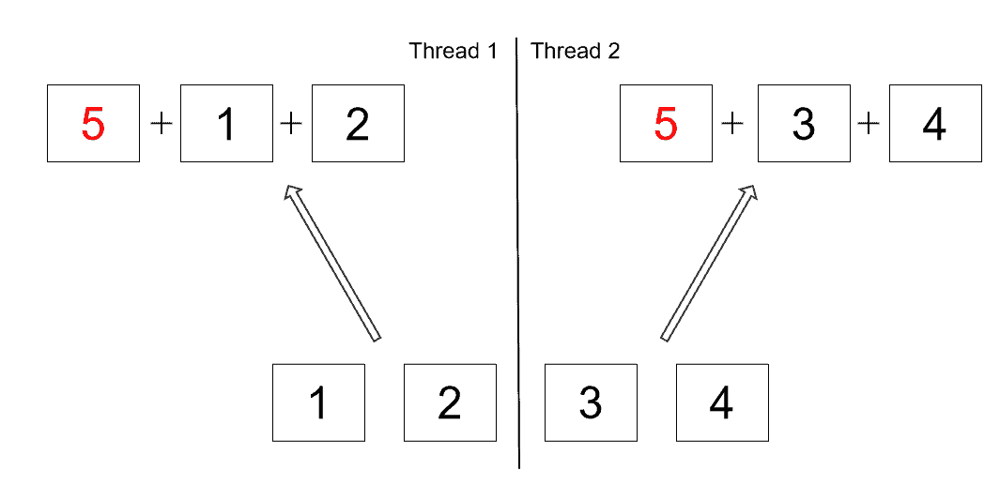

# 1. Lambda Expression

## 1.1 Definition & Syntax

A **lambda expression** is a short block of code that takes in parameters and returns a value. Lambdas look similar to methods, but they do not need a name, and they can be written right inside a method body.

**Syntax:**
```
parameter -> expression

(parameter1, parameter2) -> expression

(parameter1, parameter2) -> {
  // code block
  return result;
}
```

**Why Use Lambda Expressions?**
- **Concise Code:** Reduce boilerplate compared to anonymous classes.
- **Functional Programming:** Treat functions as first-class citizens.
- **Improved Readability:** Code is easier to read and maintain.
- **Enhanced Collections and Streams:** Simplify operations like filtering, mapping, and iterating.

## 1.2 Using Lambda Expressions

Lambdas are often passed as arguments to methods. For example, you can use a lambda in the `forEach()` method of an `ArrayList`:

```java
public static void main(String[] args) {
    ArrayList<Integer> numbers = Arrays.asList(1, 2, 3, 4);
    numbers.forEach(n -> System.out.println(n));
}
```

## 1.3 Lambdas in Variables

A lambda expression can be stored in a variable. The variable's type must be an interface with exactly one method (a **functional interface**). The lambda must match that method's parameters and return type.

Java includes many built-in functional interfaces, such as `Consumer` (from the `java.util package`) used with lists.

```java
public static void main(String[] args) {
    ArrayList<Integer> numbers = Arrays.asList(1, 2, 3, 4);
    Consumer<Integer> method = (n) -> { System.out.println(n); };
    numbers.forEach(method);
}
```

## 1.4 Lambdas as Method Parameters

You can also pass a lambda expression to a method. The method's parameter must be a functional interface. Calling the interface's method will then run the lambda expression:

```java
interface StringFunction {
    String run(String str);
}

public class Main {
    public static void main(String[] args) {
        StringFunction exclaim = (s) -> s + "!";
        StringFunction ask = (s) -> s + "?";
        printFormatted("Hello", exclaim);
        printFormatted("Hello", ask);
    }

    public static void printFormatted(String str, StringFunction format) {
        String result = format.run(str);
        System.out.println(result);
    }
}
```

## 1.5 Anonymous Class vs. Lambda Expression

Anonymous Class

```java
interface Greeting {
    void sayHello();
}

public class Main {
    public static void main(String[] args) {
        Greeting g = new Greeting() {
            public void sayHello() {
            System.out.println("Hello from anonymous class");
            }
        }; 
        g.sayHello();
    }
}
```
Lambda Expression (Functional Interface)

```java
// interface has exactly one abstract method, lambda expression will provide its implementation
@FunctionalInterface // Optional but recommended
interface Greeting {
    void sayHello();
}

public class Main {
    public static void main(String[] args) {
        Greeting g = () -> System.out.println("Hello from lambda");
        g.sayHello();
    }
}
```

>**Rule of thumb:** Use a `lambda` for short, single-method interfaces. Use an anonymous class when you need to override multiple methods, add fields, or extend a class.

## 1.6 Common built-in functional interfaces

| Interface | Method | Purpose |
| --------------- | --------------- | --------------- |
| `Predicate` | `boolean test(T t)` | Tests a given condition and returns true or false. |
| `Consumer` | `void accept(T t)` | Performs an action on the given argument without returning a result. |
| `Supplier` | `T get()` | Supplies or generates a result without taking any input. |
| `Comparator<T>` | `int compare(T o1, T o2)` | Compares two objects to determine their order. |
| `Comparable<T>` | `int compareTo(T o)` | Defines the natural ordering for objects of a class. |


# 2. Stream

## 2.1 Sequential Stream

Stream was introduced in Java 8, the Stream API is used to process collections of objects. A stream in Java is a sequence of objects that supports various methods that can be pipelined to produce the desired result. 

### 2.1.1 Stream Methods

**`forEach()`**: iterate though elements in stream.

**`average()`**, **`count()`**, **`min()`**, **`max()`**

**`reduce()`**: reduce the elements of the stream to a single value.

**`filter()`**: select elements as per the Predicate passed as an argument.

**`sorted()`**: sort the stream.

**`map()`**: manipulate elements in the stream.

**`distinct()`**: return a stream with distinct elements.

**`limit()`**: indicate limit of elements to manipulate.

## 2.2 Parallel Stream

Any stream in Java can easily be transformed from sequential to parallel.

We can achieve this by **adding the parallel method to a sequential stream or by creating a stream using the parallelStream method of a collection**:

```java
List<Integer> listOfNumbers = Arrays.asList(1, 2, 3, 4);
listOfNumbers.parallelStream().forEach(number ->
    System.out.println(number + " " + Thread.currentThread().getName())
);
```

Parallel streams enable us to execute code in parallel on separate cores. The final result is the combination of each individual outcome.

However, the order of execution is out of our control. It may change every time we run the program:

**Output:**
```
4 ForkJoinPool.commonPool-worker-3
2 ForkJoinPool.commonPool-worker-5
1 ForkJoinPool.commonPool-worker-7
3 main
```

## 2.3 Fork-Join Framework

Parallel streams make use of the fork-join framework and its common pool of worker threads.

The [fork-join](https://www.baeldung.com/java-fork-join) framework was added to java.util.concurrent in Java 7 to handle task management between multiple threads.

### 2.3.1 Splitting Source

The fork-join framework is in charge of **splitting the source data between worker threads and handling callback on task completion**.

Let’s take a look at an example of calculating a sum of integers in parallel.

We’ll make use of the reduce method and add five to the starting sum, instead of starting from zero:

```java
List<Integer> listOfNumbers = Arrays.asList(1, 2, 3, 4);
int sum = listOfNumbers.parallelStream().reduce(5, Integer::sum);
assertThat(sum).isNotEqualTo(15);
```

In a sequential stream, the result of this operation would be 15.

But since the reduce operation is handled in parallel, the number five actually gets added up in every worker thread:



The actual result might differ depending on the number of threads used in the common fork-join pool.

In order to fix this issue, the number five should be added outside of the parallel stream:

```java
List<Integer> listOfNumbers = Arrays.asList(1, 2, 3, 4);
int sum = listOfNumbers.parallelStream().reduce(0, Integer::sum) + 5;
assertThat(sum).isEqualTo(15);
```

>Therefore, we need to be careful about which operations can be run in parallel.

### 2.3.2 Common Thread Pool

The number of threads in the common pool is equal to (the number of processor cores - 1).

The API allows us to specify the number of threads it will use by passing a JVM parameter:

```
-D java.util.concurrent.ForkJoinPool.common.parallelism=4
```

### 2.3.3 Custom Thread Pool

```java
List<Integer> listOfNumbers = Arrays.asList(1, 2, 3, 4, 5);
ForkJoinPool customeThreadPool = new ForkJoinPool(4);
int sum = customeThreadPool.submit(() -> listOfNumbers.parallelStream()
                                        .reduce(0, Integer::sum)).get();
customeThreadPool.shutdown();
// 10
```

>**Using custome thread pool is recommended by Oracle**. We should have a very good reason for running parallel streams in custom thread pools.

## 2.4 When to use Parallel Stream

Parallelism can bring performance benefits in certain use cases. But parallel streams cannot be considered as a magical performance booster. So, **sequential streams should still be used as default during development**.

A sequential stream can be converted to a parallel one when we **have actual performance requirements**. Given those requirements, we should first run a performance measurement and consider parallelism as a possible optimization strategy.

A large amount of data and many computations done per element indicate that parallelism could be a good option.

On the other hand, a small amount of data, unevenly splitting sources, expensive merge operations and poor memory locality indicate a potential problem for parallel execution.
